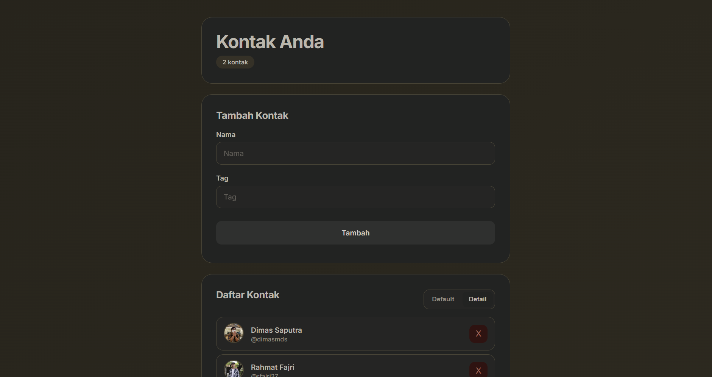

# Contacts Application

 

A lightweight and responsive contact management web application built with **React** (Class Components) and **Vite**.

## Key Features
* **Full CRUD Operations:** Seamlessly add new contacts (with profile pictures) or delete existing ones.
* **Dynamic View Modes:** Toggle between **Default** and **Detail** layouts to suit your visual preference.
* **Data Persistence:** Automatically saves and syncs your contact list to the browser's `localStorage` (no database required).
* **Form Validation:** Prevents empty or invalid contact submissions.

## Tech Stack
* **Framework:** React 18 & Vite 4
* **Language:** JavaScript (ES Modules)
* **Styling:** Standard CSS

## Quick Start
Make sure you have [Node.js](https://nodejs.org/) installed, then run the following commands:

1. **Install dependencies:**
   ```bash
   npm install

2. **Run development mode:**
	```bash
	npm run dev

3. Open the local URL shown in the terminal (usually `http://localhost:5173`).

## Build Production

```bash
npm run build
```